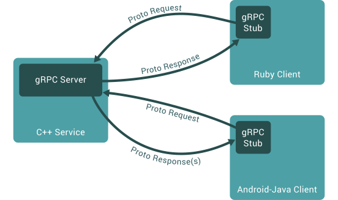

# gRPC Introduce(Golang)

## 1 安装

### 1.1 安装Go1.6以上版本
请遵照官方引导[Getting Started - The Go Programming Language](https://golang.org/doc/install)

### 1.2 安装gRPC
执行以下命令
```
go get -u google.golang.org/grpc
```
因依赖较多，下载时间较长  
PS: 需翻墙，若使用Shadowsocks，则需搭配本地http代理工具，如Proxifier

### 1.3 安装Protocol Buffers v3
1. 下载protoc编译器[Github官方下载源](https://github.com/google/protobuf/releases)
2. 解压缩文件并将文件夹存放入合适的路径
3. 更新环境变量`PATH`，以包含protoc二进制文件路径
```
vim ~/.bash_profile
```
```
export GOPATH=$HOME/Dev/Golang
export GOBIN=$HOME/Dev/Golang/bin
export PATH=$PATH:$HOME/Dev/protoc-3.6.0-osx-x86_64/bin
```
4. 安装protoc Go插件
```
go get -u github.com/golang/protobuf/protoc-gen-go
```
PS: 需翻墙，若使用Shadowsocks，则需搭配本地http代理工具，如Proxifier
并向环境变量`PATH`添加`GOPATH`可执行路径
```
vim ~/.bash_profile
```
```
export PATH=$PATH:$GOPATH/bin
```
5. 重新开启命令行终端并输入`protoc`命令查看是否已具备该命令

## 2 gPRC概述
gRPC是一种基于分布式服务理念的远程过程调用方式。  
在服务器端，服务器实现了相关接口并启动gRPC服务来接受客户端调用；  
在客户端，通过实现gRPC桩模块(stub)来提供与服务器端相同的可调用方法。  


### 2.1 gRPC服务类型
1. 一元远程过程调用(Unary RPCs)  
客户端发送一个单独的请求并收到一个单独的响应，就像一个常见的函数调用一样
```
rpc SayHello(HelloRequest) returns (HelloResponse){}
```
2. 服务端流式远程过程调用(Server streaming RPCs)  
客户端发送一个单独的请求并收到服务端返回一组响应序列，客户端依次读取这一组响应序列直至读完
```
rpc LotsOfReplies(HelloRequest) returns (stream HelloResponse){}
```
3. 客户端流式远程过程调用(Client streaming RPCs)
客户端写入一组消息序列并发送给服务端，客户端发送完毕后即等待服务端读取并回复响应信息
```
rpc LotsOfGreetings(stream HelloRequest) returns (HelloResponse) {}
```
4. 双向流式远程过程调用(Bidirectional streaming RPCs)  
客户端与服务端均通过可读写的数据流发送一组消息序列，两个数据流的操作相互独立，因此两者间可使用任意的读写顺序，比如服务端可等待收到全部信息后再开始进行响应，也可以交替的读一个信息写一个响应，或者进行组合式的读写。每个数据流中的消息顺序是可保证的。
```
rpc BidiHello(stream HelloRequest) returns (stream HelloResponse){}
```

### 2.2 RPC生命周期
#### 2.2.1 Unary RPC
1. 客户端一旦调用方法，服务端即会得到通知，通知包含客户端的元数据、方法名称、响应截止时间（如果可用的话）
2. 服务端可立即返回其元数据，或者继续等待客户端的请求消息，这取决于应用的具体实现
3. 一旦收到客户端的请求信息，服务端创建并发送对应的响应信息。响应会随着状态详情（状态码和可选的状态信息）和可选的后缀元数据一起返回到客户端
4. 如果状态是`OK`，客户端即获得响应信息，客户端此次调用完成

#### 2.2.2 Server streaming RPC
除服务端是在获取客户端请求后返回一组响应序列外，基本与`Unary RPC`相同，待全部响应返回后，服务端最后发送状态详情和可选的后缀元数据，客户端收到全部响应后此次调用完成
#### 2.2.3 Client streaming RPC
除客户端是发送一组请求序列外，基本与`Unary RPC`相同，服务端仅返回一组响应信息，通常在收到全部请求信息后，但不绝对，最后发送状态详情和可选的后缀元数据
#### 2.2.4 Bidirectional streaming RPC
1. 客户端调用方法，服务端得到通知，通知包含客户端的元数据、方法名称、响应截止时间（如果可用的话）
2. 服务端可立即返回其元数据，或者继续等待客户端开发发送请求消息
3. 随后的消息发送响应顺序取决于具体实现，可以是服务端收到全部请求消息后再开始响应，也可以是像打乒乓球一样，客户端发送一个请求，服务端发送一个响应，然后客户端再发送一个基于上次响应信息的请求，周而复始

#### 2.2.5 截止时间/超时时长
gRPC允许客户端指定一个其等待的最大时长，超时则RPC调用以`DEADLINE_EXCEEDED`报错结束。服务器端可以查看具体的截止时间或者还有多久超时  
截止时间/超时时长是与具体的编程语言相关的，有的没有设置默认值，有的是设置的截止时间（a fixed point in time），有的是设置的超时时长（durations of time）

#### 2.2.6 RPC终止
在gRPC中，客户端和服务端均有独立的是否调用成功的判断，但是两者的结果可能并不匹配。即可能存在服务器声称调用成功但客户端声称调用失败的可能。服务端在客户端发送完其全部请求前即判断调用完成也是可能的

#### 2.2.7 取消RPC
客户端和服务端均可取消RPC调用，此取消是立即终止了RPC调用。取消(cancel)不同于撤销(undo)，取消之前的变更不可被回滚(roll back)

#### 2.2.8 元数据
元数据是一组关于特定RPC的键值对列表信息(如[鉴权详情](https://grpc.io/docs/guides/auth.html))，其中key值为字符串，value通常为字符串（但也可能为二进制数据），元数据对gRPC本身是不透明的，其信息由客户端提供，随调用送至服务端，反之亦然。对元数据的访问是语言相关的

#### 2.2.9 频道（Channels）
gRPC频道在客户端和服务端直接提供了一个在用的指定主机和端口的连接，客户端可以指定频道的参数来改变gRPC的默认表现，比如设置消息是否压缩。频道是有状态的，包括`connected`和`idle`，有些语言不允许查询频道的状态。gRPC如何关闭频道是语言相关的

### 2.3 Protocol Buffers
gRPC默认使用[Protocol Buffers](https://developers.google.com/protocol-buffers/docs/overview)来作为其接口定义语言(IDL-Interface Definition Language)以序列化数据结构。
相较于目前主流的数据格式JSON，Protocol Buffers更高效。  
在js to Java的通信场景下，因JSON与js的天然兼容性，Protocol Buffers性能仅快约10%；但在Java to Java的场景下，Protocol Buffers快了约6倍。According to [Beating JSON performance with Protobuf](https://auth0.com/blog/beating-json-performance-with-protobuf/)

Protocol Buffers数据结构定义与.proto文件中，其中数据被抽象为消息存在，消息是一小块逻辑记录，其包含了一系列也被称之为fields的name-value对的信息，如下所示
```
message Person {
  string name = 1;
  int32 id = 2;
  bool has_ponycopter = 3;
}
```
其中name-value对遵循以下格式
```
type name = index
```
一个较完整的定义了gRPC服务的.proto文件内容如下所示：
```
// The greeter service definition.
service Greeter {
  // Sends a greeting
  rpc SayHello (HelloRequest) returns (HelloReply) {}
}

// The request message containing the user's name.
message HelloRequest {
  string name = 1;
}

// The response message containing the greetings
message HelloReply {
  string message = 1;
}
```
建议使用proto3语法。  
如需了解更多关于Protocol Buffers的内容，请参考[Protocol Buffers documentation](https://developers.google.com/protocol-buffers/docs/overview)

#### 2.3.1 消息类型(Message Type)
```
syntax = "proto3";  // 声明使用`proto3`语法

// 定义名为`SearchRequest`的消息
message SearchRequest {
  string query = 1;
  int32 page_number = 2;
  int32 result_per_page = 3;
}
```
1. 每个消息声明了一系列字段(field, name/value pair)，每个字段均有一个名字和类型  
2. 类型可分为标量类型(数据单元或一个简单值)和复合类型(枚举型和消息型)  
3. 消息中每个字段都有一个唯一数值，该数值被用于在消息的二进制格式下识别不同字段。其中1-15占用1字节，16-2047占用2字节，因此应尽量将1-15用于高频出现的消息元素。建议预留部分1-15区间的数值以作备用。  
4. 字段数值区间为1 ~ 2^29 - 1(536,870,911)，其中19000~19999为Protocol Buffers保留字段  
5. 消息字段可分为`singular`和`repeated`两种，其中`singular`修饰的字段在一个消息中至多包含1个，`repeated`修饰的字段可出现任意次(包括0次)，重复的字段值的顺序是被保证的
6. 在`proto3`语法中，`repeated`的标量数值型默认用[`packed`](https://developers.google.com/protocol-buffers/docs/encoding.html#packed)方式编码
7. 同一个.proto文件中可定义多个消息
8. .proto文件中使用C/C++风格的注释，`//`和`/* ... */`
9. 若删除或注释已存在的字段，为避免在加载老版本时产生诸如资料损坏、隐私bug等严重问题，需对相关字段标明保留关键字`reserved`。
```
message Foo {
  reserved 2, 15, 9 to 11;
  reserved "foo", "bar";
}
```
`Note`: 不得在同一行保留声明中混写名称和字段数值

#### 2.3.2 标量值类型

| .proto Type | Notes | Go Type |
| ----------- | ----- | ------- |
| double |  | float64 |
| float |  | float32 |
| int32 | Uses variable-length encoding. Inefficient for encoding negative numbers – if your field is likely to have negative values, use sint32 instead. | int32 |
| int64 | Uses variable-length encoding. Inefficient for encoding negative numbers – if your field is likely to have negative values, use sint64 instead.	 | int64 |
| uint32 | Uses variable-length encoding.	 | uint32 |
| uint64 | Uses variable-length encoding.	 | uint64 |
| sint32 | Uses variable-length encoding. Signed int value. These more efficiently encode negative numbers than regular int32s. | int32 |
| sint64 | Uses variable-length encoding. Signed int value. These more efficiently encode negative numbers than regular int64s | int64 |
| fixed32 | Always four bytes. More efficient than uint32 if values are often greater than 228 | uint32 |
| fixed64 | Always eight bytes. More efficient than uint64 if values are often greater than 256 | uint64 |
| sfixed32 | Always four bytes. | int32 |
| sfixed64 | Always eight bytes. | int64 |
| bool |  | bool |
| string | A string must always contain UTF-8 encoded or 7-bit ASCII text. | string |
| bytes | May contain any arbitrary sequence of bytes. | []byte |

#### 2.3.3 默认值
1. string型的默认值为空字符串
2. bytes型的默认值为空比特
3. bool型的默认值为false
4. 数值类型的默认值为0
5. 枚举型的默认值为第一个枚举值，其必为0
6. 对消息型，不对字段做设置，其准确值依赖具体的实现语言，可参考[generated code guide](https://developers.google.com/protocol-buffers/docs/reference/overview)
7. repeated字段的默认值为空（通常为语言相关的空数组）
`Note`: 对字段值无法确定其是设置了与默认值相同的值还是未做设置，另对于值为默认值的字段，相关值在传输时不会被序列化

#### 2.3.4 枚举

```
message SearchRequest {
  string query = 1;
  int32 page_number = 2;
  int32 result_per_page = 3;
  enum Corpus {
    UNIVERSAL = 0;
    WEB = 1;
    IMAGES = 2;
    LOCAL = 3;
    NEWS = 4;
    PRODUCTS = 5;
    VIDEO = 6;
  }
  Corpus corpus = 4;
}
```
1. 使用`enum`关键词进行修饰
2. 必须有一个0值的枚举值，且此枚举值必须是第一个元素
3. 如果有多个枚举值具有相同的属性值，需将`allow_alias`选型设置为`true`
```
enum EnumAllowingAlias {
  option allow_alias = true;
  UNKNOWN = 0;
  STARTED = 1;
  RUNNING = 1;
}
enum EnumNotAllowingAlias {
  UNKNOWN = 0;
  STARTED = 1;
  // RUNNING = 1;  // Uncommenting this line will cause a compile error inside Google and a warning message outside.
}
```
4. 枚举值的属性值必须为32比特范围内的常量整数，不推荐使用负数
5. 枚举可定义于消息体内部或外部，访问其他消息体内的枚举值可使用`MessageType.EnumType`语法
6. 反序列化时，未被识别的枚举值会被保留在消息中，但其如何被表示是语言相关的，在Go语言中，该枚举值会保留其底层整数值
7. 若删除或注释已存在的枚举值，为避免在加载老版本时产生诸如资料损坏、隐私bug等严重问题，需对相关枚举值标明保留关键字`reserved`。可用`max`表示最大值
```
enum Foo {
  reserved 2, 15, 9 to 11, 40 to max;
  reserved "FOO", "BAR";
}
```
`Note`: 不得在同一行保留声明中混写名称和字段数值

#### 2.3.5 使用其他消息类型
可在一个消息中使用另一个消息作为其字段类型
```
message SearchResponse {
  repeated Result results = 1;
}

message Result {
  string url = 1;
  string title = 2;
  repeated string snippets = 3;
}
```
1. 可通过`import`声明来引用在其他.proto文件中定义的消息类型
2. `import public`声明可使引用了当前.proto文件的同时递归的引用被导入的.proto文件，通常这种方式可用于重定位被移动的.proto文件
```
// new.proto
// All definitions are moved here
```
```
// old.proto
// This is the proto that all clients are importing.
import public "new.proto";
import "other.proto";
```
```
// client.proto
import "old.proto";
// You use definitions from old.proto and new.proto, but not other.proto
```
3. 编译器默认在当前目录下寻找相关.proto文件，也可以通过`-I/--proto_path`参数进行指定

#### 2.3.6 嵌套类型
1. 可以在消息内部定义和使用其他消息类型
```
message SearchResponse {
  message Result {
    string url = 1;
    string title = 2;
    repeated string snippets = 3;
  }
  repeated Result results = 1;
}
```
2. 若需在该消息外包使用，可通过`Parent.Type`语法
```
message SomeOtherMessage {
  SearchResponse.Result result = 1;
}
```
3. 可做任意多层嵌套
```
message Outer {                  // Level 0
  message MiddleAA {  // Level 1
    message Inner {   // Level 2
      int64 ival = 1;
      bool  booly = 2;
    }
  }
  message MiddleBB {  // Level 1
    message Inner {   // Level 2
      int32 ival = 1;
      bool  booly = 2;
    }
  }
}
```

#### 2.3.7 更新消息类型
1. 不得改变已存在字段的字段号
2. 若新增字段，新老代码对消息的编码和解析均能正常进行，只是对老代码来说，无法解析新字段而已
3. 可以删除字段，但是需要对相关字段增加`OBSOLETE_`前缀或者对字段号用保留关键字`reserved`进行修饰，以防未来其他人误用引起意外
4. 数据类型int32, uint32, int64, uint64, bool彼此之间相互兼任，这意外着可以在这些类型间变更类型的时候，保证代码的前向和后向兼容（但可能发生数字截断）
5. sint32和sint64彼此兼容，但是与其他整型不兼容
6. 在字节是有效的UTF-8编码的前提下，string和bytes彼此兼容
7. 内嵌消息类型与可被解析成消息型的bytes相互兼任
8. fixed32和sfixed32，fixed64和sfixed64彼此兼容
9. 枚举型与int32, uint32, int64, uint64在传输格式上彼此兼容（但是可能会被截断），对未被识别的枚举型，会保留其真实值，但是具体呈现与语言相关
10. 将单个字段变更为`oneof`修饰是安全的，对多个字段重新进行`oneof`修饰只要能保证这些字段最多只有一个有值则是安全的，若是多个字段均可能有值，则修饰为`oneof`是不安全的

#### 2.3.8 未知字段
未知字段是指那些格式正确，但是无法被解析者识别的字段，比如对于老版本解析含有新增字段的新版本生成的数据，该新增字段对于老版本来说即为未知字段  
proto3.5及后续版本，未知字段在解析时会被保留，并包含在序列化的输出中

#### 2.3.9 Any
1. `Any`消息类型可以让你在没有相关声明文件的时候将一个消息作为内嵌类型使用。  
2. `Any`类型将任意类型的消息转换为`bytes`数据，并连同URL一起作为消息类型的全局惟一标识符且解析为该消息的类型。
3. 若想使用`Any`类型，需导入`google/protobuf/any.proto`

```
import "google/protobuf/any.proto";

message ErrorStatus {
  string message = 1;
  repeated google.protobuf.Any details = 2;
}
```

#### 2.3.10 Oneof
当多个字段在某个时刻仅可能存在一个字段有值时，可使用`oneof`对这组字段进行修饰
```
message SampleMessage {
  oneof test_oneof {
    string name = 4;
    SubMessage sub_message = 9;
  }
}
```

1. `oneof`字段除了彼此之间共享同一块内存外与普通字段并无区别
2. 在同一时间仅有一个`oneof`字段可以被设置，
3. 对一组`oneof`字段中的一个字段设置时，会自动的清空其他同组字段
4. 可以根据使用的语言选择`case()`或`WhichOneof()`方法来判断一组`oneof`字段中哪个字段有值
5. 在`oneof`组中可以使用任意类型，但是不能定义`repeated`字段

#### 2.3.11 Maps
可以用以下语法创建映射类型
```
map<key_type, value_type> map_field = N;
```
1. `key_type`可以是整型(integral type)或者字符串型(string type)，事实上，除了浮点型(floating point types)和字节型(bytes)的任意标量类型均可，但不能是`enum`类型
2. `value_type`可以是除了map型的任意其他类型
3. `map_field`不能被`repeated`修饰
4. map内元素的排序是不被保证的
5. 当被文本化输出的时候，map会根据key值进行排序
6. 当在传输时或合并时，若出现多个同key值的字段，只有最后一个会被使用；当从文本格式中解析时，出现多个同key值字段会导致解析失败
7. 若key没有对应的value，则表现需视具体的语言而定

```
map<string, Project> projects = 3;
```

#### 2.3.12 Packages
可以在.proto文件中使用可选的修饰词`package`来防止同名消息类型之间的命名冲突
```
package foo.bar;
message Open { ... }
```
```
message Foo {
  ...
  foo.bar.Open open = 1;
  ...
}
```
`Note`: package声明对生产的源代码的影响需视不同语言而定，对Go语言，会默认使用相应的Go包名(Go package name)，除非你在.proto文件中显式的指定可选修饰词`go_package`的属性

#### 2.3.13 与JSON的映射关系
请参考[JSON Mapping](https://developers.google.com/protocol-buffers/docs/proto3#json)

### 3 Proto Buffers编写风格规约
#### 3.1 消息和字段命名规则
1. 对消息命名，使用大写字母开头的驼峰命名法，如`SongServerRequest`
2. 对字段命名，使用小写字母组成的下划线分割命名法(underscore_separated_names)，如`song_name`

```
message SongServerRequest {
  required string song_name = 1;
}
```
#### 3.2 枚举命名规则
1. 对枚举类型使用大写字母开头的驼峰命名法，如`Foo`
2. 对枚举值使用大写字母组成的下划线分割命名法(CAPITALS_WITH_UNDERSCORES)，如`FIRST_VALUE`

```
enum Foo {
  FIRST_VALUE = 0;
  SECOND_VALUE = 1;
}
```
#### 3.3 服务命名规则
1. 对服务名称使用大写字母开头的驼峰命名法，如`FooService`
2. 对服务内的方法名称使用大写字母开头的驼峰命名法，如`GetSomething`

```
service FooService {
  rpc GetSomething(FooRequest) returns (FooResponse);
}
```

### 4 HttpRule
HttpRule定义了RPC方法到RESTful API方法的映射。  
该映射详细指明了RPC请求消息部分的不同部分到URL path、query parameters、request body的映射关系。  
这种映射关系通常被称之为RPC方法的`google.api.http`注释（更多详情可参考"google/api/annotations.proto"）。  
`NOTE`: All service configuration rules follow "last one wins" order.  

映射关系包含一个字段来指明路径模板(path template)和方法类型(method kind)，其中路径模板可以引用请求消息中的字段，下面的示例描述了一个REST化的请求消息资源的操作。
```
service Messaging {
  rpc GetMessage(GetMessageRequest) returns (Message) {
    option (google.api.http).get = "/v1/messages/{message_id}/{sub.subfield}";
  }
}
message GetMessageRequest {
  message SubMessage {
    string subfield = 1;
  }
  string message_id = 1; // mapped to the URL
  SubMessage sub = 2;    // `sub.subfield` is url-mapped
}
message Message {
  string text = 1; // content of the resource
}
```
| HTTP | RPC |
| ---- | --- |
| GET /v1/messages/123456/foo | GetMessage(message_id: "123456" sub: SubMessage(subfield: "foo")) |
`Note`: 映射到路径中的字段必须是非`repeated`的基础类型(non-message)

请求消息中未映射到路径中的字段会被自动映射成为query参数
```
service Messaging {
  rpc GetMessage(GetMessageRequest) returns (Message) {
    option (google.api.http).get = "/v1/messages/{message_id}";
  }
}
message GetMessageRequest {
  message SubMessage {
    string subfield = 1;
  }
  string message_id = 1; // mapped to the URL
  int64 revision = 2;    // becomes a parameter
  SubMessage sub = 3;    // `sub.subfield` becomes a parameter
}
```
| HTTP | RPC |
| ---- | --- |
| GET /v1/messages/123456?revision=2&sub.subfield=foo | GetMessage(message_id: "123456" revision: 2 sub: SubMessage(subfield: "foo")) |
`Note`: 映射成为参数的字段必须为基础类型或者`repeated`的基础类型，不得使用`Message`，对`repeated`类型，其映射为`...?param=A&param=B`

对可以使用request body的HTTP方法，`body`字段指明了映射关系，对一个消息集合进行REST化的更新方法如下所示：
```
service Messaging {
  rpc UpdateMessage(UpdateMessageRequest) returns (Message) {
    option (google.api.http) = {
      put: "/v1/messages/{message_id}"
      body: "message"
    };
  }
}
message UpdateMessageRequest {
  string message_id = 1; // mapped to the URL
  Message message = 2;   // mapped to the body
}
message Message {
  string message_id = 1;
  string text = 2;
}
```
| HTTP | RPC |
| ---- | --- |
| PUT /v1/messages/123456 { "text": "Hi!" } | UpdateMessage(message_id: "123456" message { text: "Hi!" }) |

如果使用了`*`来定义`body`字段，那么除了映射到路径模板中字段，其余字段均会映射到body结构中
```
service Messaging {
  rpc UpdateMessage(Message) returns (Message) {
    option (google.api.http) = {
      put: "/v1/messages/{message_id}"
      body: "*"
    };
  }
}
message Message {
  string message_id = 1;
  string text = 2;
}
```
| HTTP | RPC |
| ---- | --- |
| PUT /v1/messages/123456 { "text": "Hi!" } | UpdateMessage(message_id: "123456" text: "Hi!") |
`Note`: 在`body`关键词中使用`*`将不会再有HTTP parameters，所有不在路径模板中的字段都会被放入body部分，这也使得这种用法在实践中并不常见，而更多的是用在完全不使用URL传输数据的自定义方法上

可以使用`additional_bindings`关键词来实现多个HTTP方法到同一个RPC方法的映射
```
service Messaging {
  rpc GetMessage(GetMessageRequest) returns (Message) {
    option (google.api.http) = {
      get: "/v1/messages/{message_id}"
      additional_bindings {
        get: "/v1/users/{user_id}/messages/{message_id}"
      }
    };
  }
}
message GetMessageRequest {
  string message_id = 1;
  string user_id = 2;
}
```

#### 4.1 HTTP映射规则
1. `body`关键字只能声明为`*`或字段路径，或省略。若省略，则表明无HTTP request body
2. 叶子字段（请求中内嵌信息递归展开的全部字段）可分为以下四种：
 * a) 匹配URL模板的字段
 * b) 被body部分覆盖（如果body属性为`*`，则覆盖除了a)涉及的字段；否则覆盖所有body属性提及的字段）
 * c) 所有其他的字段
3. c)所属的字段映射到HTTP请求中的URL query参数
4. 任何HTTP请求中body包含的信息只能是b)涉及的字段

路径模板的语法规则如下所示：
```
Template = "/" Segments [ Verb ] ;
Segments = Segment { "/" Segment } ;
Segment  = "*" | "**" | LITERAL | Variable ;
Variable = "{" FieldPath [ "=" Segments ] "}" ;
FieldPath = IDENT { "." IDENT } ;
Verb     = ":" LITERAL ;
```
1. `*`匹配了一个单独的路径段，`**`匹配>=0个路径段，以上两种语法必须位于除了`Verb`的末尾部分
2. `LITERAL`语法匹配路径中的普通字符
3. `Variable`语法通过由其模板指定来匹配的部分URL路径，变量内不得包含其他变量，如果变量独占一个路径段，则其模板部分可被省略，如{var}与{var=\*}等同
4. `Variable`部分可包括至少一个路径段，如{var}或{var=\*}、{var=foo/\*}或{var=\**}，当该变量代入URL中时，除`[-_.~/0-9a-zA-Z]`外的其他字符都会被URLEncode处理
`Note`: 变量或`body`属性中的字段均不得引用`repeated`或map字段

关键字列表  

| Field | Description |
| ----- | ----------- |
| selector | `string`  Selects methods to which this rule applies. |
| body | `string`  The name of the request field whose value is mapped to the HTTP body, or * for mapping all fields not captured by the path pattern to the HTTP body. NOTE: the referred field must not be a repeated field and must be present at the top-level of request message type. |
| media_upload | [`MediaUpload`](https://cloud.google.com/service-infrastructure/docs/service-management/reference/rpc/google.api#google.api.MediaUpload)  Use this only for Scotty Requests. Do not use this for media support using Bytestream, add instead [][google.bytestream.RestByteStream] as an API to your configuration for Bytestream methods. |
| media_download | [`MediaDownload`](https://cloud.google.com/service-infrastructure/docs/service-management/reference/rpc/google.api#google.api.MediaDownload)  Use this only for Scotty Requests. Do not use this for bytestream methods. For media support, add instead [][google.bytestream.RestByteStream] as an API to your configuration. |
| additional_bindings[] | `HttpRule`  Additional HTTP bindings for the selector. Nested bindings must not contain an additional_bindings field themselves (that is, the nesting may only be one level deep). |
| get | `string`  Used for listing and getting information about resources. |
| put | `string`  Used for updating a resource. |
| post | `string`  Used for creating a resource. |
| delete | `string`  Used for deleting a resource. |
| patch | `string`  Used for updating a resource. |
| custom | [`CustomHttpPattern`](https://cloud.google.com/service-infrastructure/docs/service-management/reference/rpc/google.api#google.api.CustomHttpPattern)  The custom pattern is used for specifying an HTTP method that is not included in the pattern field, such as HEAD, or "*" to leave the HTTP method unspecified for this rule. The wild-card rule is useful for services that provide content to Web (HTML) clients. |

#### 4.2 Swagger规范的API文档自动生成
在完成了本文档第一部分`1 安装`的前提下，执行以下命令
```
go get -u github.com/grpc-ecosystem/grpc-gateway/protoc-gen-swagger
```
`Note`: 若出现不明安装错误可尝试先`go get -u github.com/grpc-ecosystem/grpc-gateway`再执行以上命令

执行以下命令生成Swagger规范的API文档

```
protoc -I/usr/local/include -I. \
  -I$GOPATH/src \
  -I$GOPATH/src/github.com/grpc-ecosystem/grpc-gateway/third_party/googleapis \
  --swagger_out=logtostderr=true:. \
  ${path/to/your_service.proto}
```
更多信息请参考[grpc-gateway](https://grpc-ecosystem.github.io/grpc-gateway/)

### 5 gRPC代码生成生成
可以通过protoc编译器配合不同的插件，来根据.proto文件生成不同语言的gRPC代码。
对Go语言，执行
```
protoc --go_out=plugins=grpc:. *.proto
```

### 6 Go-Kit框架代码自动生成
[安装truss](https://github.com/tuneinc/truss#install)  
Mac环境下
```
go get -u -d github.com/tuneinc/truss
cd $GOPATH/src/github.com/tuneinc/truss
make dependencies
make
```

```
truss --svcout ${path}/${name}-service ${pb_path}/${name}.proto
# For example
truss --svcout ./echo-service ./pb/echo.proto
```
Notes:
1. handlers包中的默认文件handlers.go、hooks.go、middlewares.go仅能定义私有function/method
2. handlers包中可添加新的golang源代码文件，新添加的文件中不限制function/method的访问权限
3. .proto文件中的各service、method、message等的命名必须严格遵照命名规范`3 Proto Buffers编写风格规约`
4. 不支持任何streaming型的gRPC
5. 不支持`oneof`修饰词
6. 每个rpc调用需包含此选项，否则可能导致truss遍历中断
```
option (google.api.http) = {};
```       


## Reference
* [gRPC - Go Quick Start](https://grpc.io/docs/quickstart/go.html#go-version)
* [Beating JSON performance with Protobuf](https://auth0.com/blog/beating-json-performance-with-protobuf/)
* [What is gRPC?](https://grpc.io/docs/guides/#protocol-buffer-versions)
* [gRPC Concepts](https://grpc.io/docs/guides/concepts.html#service-definition)
* [Language Guide (proto3)](https://developers.google.com/protocol-buffers/docs/proto3)
* [Style Guide](https://developers.google.com/protocol-buffers/docs/style)
* [Google API HttpRule](https://cloud.google.com/service-infrastructure/docs/service-management/reference/rpc/google.api#google.api.HttpRule)
* [grpc-gateway](https://grpc-ecosystem.github.io/grpc-gateway/)
